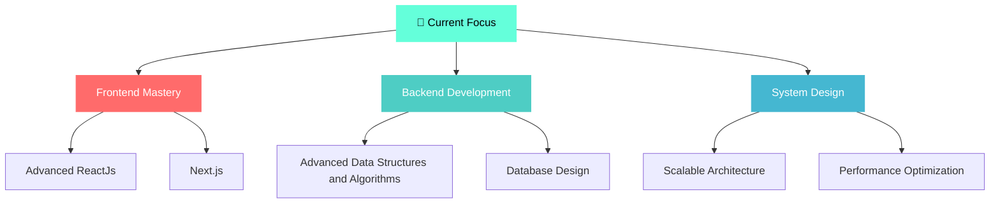

  

##  About Me
I’m a Computer Science and Engineering student working on full stack applications with a strong focus on backend logic, database design, and clean code. I enjoy collaborating on practical projects that solve real problems and contribute to my growth as a developer. I’m currently strengthening my foundations in data structures, system design, and also getting to know AI/ML better, while continuously improving my ability to build scalable, production-ready software.

## Tech Stack

**Frontend**  

**Backend & Languages**  

**Design & Tools**  

# 📊 GitHub Stats:
 
 

---

---

---

##  Let's Connect:
  

  ## 💰 You can help me by Donating
   

 
<h3>Thanks for visiting!</h3>
  

  

  
